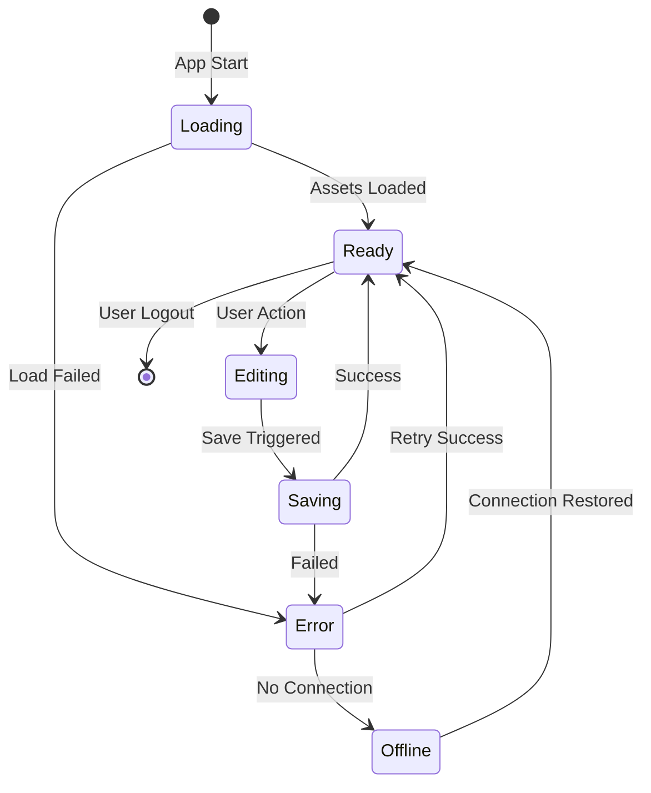

# Interaction Pattern Specifications
## Furniture Editor - Detailed Interaction Design

---

## 1. Core Interaction Patterns

### 1.1 Direct Manipulation Pattern
```yaml
pattern: Direct Manipulation
context: 3D/2D viewer canvas
principle: Objects respond immediately to user actions

interactions:
  select:
    trigger: Click/Tap on object
    feedback: 
      - Highlight with outline
      - Show transform handles
      - Display properties panel
    state: selected = true
    
  move:
    trigger: Drag selected object
    constraints:
      - Snap to grid (10mm)
      - Collision detection
      - Boundary limits
    feedback:
      - Ghost preview at target
      - Valid/Invalid indicators
      - Dimension tooltips
    
  rotate:
    trigger: Rotation handle drag
    constraints:
      - 90° increments only
      - Collision detection after rotation
    feedback:
      - Rotation angle display
      - Preview of rotated state
      
  delete:
    trigger: Delete key or context menu
    confirmation: Required for multiple items
    feedback:
      - Fade out animation
      - Undo notification
```

### 1.2 Progressive Disclosure Pattern
```yaml
pattern: Progressive Disclosure
context: Property panels and settings
principle: Show only relevant information at each step

implementation:
  basic_view:
    - Primary dimensions
    - Material selection
    - Color picker
    
  advanced_view:
    trigger: "Advanced" toggle
    reveals:
      - Custom dimensions
      - Material properties
      - Export settings
      - Performance options
      
  expert_view:
    trigger: Shift+Click on advanced
    reveals:
      - Raw JSON editor
      - Debug information
      - Performance metrics
```

### 1.3 Drag and Drop Pattern
```yaml
pattern: Drag and Drop
context: Module gallery to viewer
principle: Natural metaphor for placement

phases:
  pickup:
    trigger: MouseDown/TouchStart on module
    feedback:
      - Scale animation (0.95)
      - Cursor change to grab
      - Module lifts (shadow)
    
  drag:
    feedback:
      - Module follows cursor
      - Drop zones highlight
      - Invalid zones dim
      - Snap indicators show
    constraints:
      - Keep within viewport
      - Show measurements
      
  drop:
    valid:
      feedback:
        - Snap animation
        - Success sound
        - Ripple effect
      action: Place module
      
    invalid:
      feedback:
        - Shake animation
        - Return to origin
        - Error message
      action: Cancel operation
```

---

## 2. Micro-Interactions

### 2.1 Hover States
```css
/* Button Hover */
.button:hover {
  transform: translateY(-1px);
  box-shadow: 0 4px 12px rgba(0,0,0,0.15);
  transition: all 200ms ease;
}

/* Module Card Hover */
.module-card:hover {
  border-color: var(--primary);
  background: var(--hover-bg);
  cursor: grab;
}

/* 3D Object Hover */
.mesh:hover {
  emissive: 0x444444;
  emissiveIntensity: 0.2;
}
```

### 2.2 Loading States
```yaml
skeleton_loading:
  duration: 1-3 seconds
  pattern: Shimmer effect
  elements:
    - Module cards
    - Property panels
    - 3D viewport
    
spinner_loading:
  duration: > 3 seconds
  message: Dynamic progress text
  cancelable: After 10 seconds
  
progressive_loading:
  priority:
    1. UI shell
    2. Critical content
    3. 3D assets
    4. Additional features
```

### 2.3 Transition Animations
```javascript
// View mode transition
const viewTransition = {
  duration: 500,
  easing: 'cubic-bezier(0.4, 0, 0.2, 1)',
  properties: ['camera', 'lighting', 'controls']
};

// Panel slide
const panelSlide = {
  duration: 300,
  easing: 'ease-out',
  transform: 'translateX(100%) → translateX(0)'
};

// Module placement
const placementAnimation = {
  duration: 200,
  sequence: [
    { scale: 1.1, opacity: 0.8 },
    { scale: 1.0, opacity: 1.0 }
  ]
};
```

---

## 3. Gesture Controls

### 3.1 Mouse Gestures
| Gesture | Action | Context |
|---------|--------|---------|
| Click | Select | Any selectable |
| Double-click | Quick edit | Modules, dimensions |
| Right-click | Context menu | Any element |
| Drag | Move/Pan | Selected items/Viewport |
| Scroll | Zoom | Over viewport |
| Shift+Drag | Constrain axis | During move |
| Ctrl+Drag | Duplicate | Selected module |
| Alt+Drag | Rotate | Selected module |

### 3.2 Touch Gestures
```yaml
single_touch:
  tap:
    action: Select
    feedback: Highlight
    
  long_press:
    duration: 500ms
    action: Context menu
    feedback: Haptic + menu
    
  drag:
    action: Pan viewport
    sensitivity: 1:1 movement
    
double_touch:
  pinch:
    action: Zoom
    range: 25% - 400%
    center: Between fingers
    
  rotate:
    action: Rotate view (3D only)
    threshold: 15 degrees
    
  spread:
    action: Expand selection
    feedback: Rubber band
    
triple_touch:
  swipe_up:
    action: Show panels
    
  swipe_down:
    action: Hide panels
```

### 3.3 Keyboard Navigation
```yaml
navigation:
  Tab: Next focusable element
  Shift+Tab: Previous element
  Arrow_Keys: Navigate within groups
  Enter: Activate element
  Escape: Cancel/Close
  
viewport_control:
  WASD: Pan camera
  QE: Rotate camera
  RF: Zoom in/out
  Space: Reset view
  V: Toggle 2D/3D
  
selection:
  Ctrl+A: Select all
  Ctrl+D: Deselect all
  Shift+Click: Add to selection
  Ctrl+Click: Toggle selection
  
operations:
  Ctrl+Z: Undo
  Ctrl+Y: Redo
  Ctrl+S: Save
  Ctrl+E: Export
  Delete: Remove selected
```

---

## 4. Feedback Systems

### 4.1 Visual Feedback
```yaml
immediate_feedback:  # < 50ms
  - Hover states
  - Focus indicators
  - Active states
  
short_feedback:  # 50-200ms
  - Micro-animations
  - Transitions
  - Loading spinners
  
long_feedback:  # > 200ms
  - Progress bars
  - Skeleton screens
  - Step indicators

color_coding:
  success: "#28a745"  # Green
  warning: "#ffc107"  # Yellow
  error: "#dc3545"    # Red
  info: "#17a2b8"     # Blue
  neutral: "#6c757d"  # Gray
```

### 4.2 Audio Feedback (Optional)
```javascript
const sounds = {
  select: { 
    file: 'click.mp3',
    volume: 0.3,
    duration: 50
  },
  place: {
    file: 'snap.mp3',
    volume: 0.4,
    duration: 100
  },
  error: {
    file: 'error.mp3',
    volume: 0.5,
    duration: 200
  },
  success: {
    file: 'success.mp3',
    volume: 0.4,
    duration: 300
  }
};
```

### 4.3 Haptic Feedback (Mobile)
```yaml
light_impact:
  intensity: 1
  duration: 10ms
  triggers:
    - Button tap
    - Toggle switch
    
medium_impact:
  intensity: 2
  duration: 20ms
  triggers:
    - Module snap
    - Successful drop
    
heavy_impact:
  intensity: 3
  duration: 30ms
  triggers:
    - Error/Invalid action
    - Boundary hit
    
selection_change:
  pattern: Light tick
  triggers:
    - Moving through list
    - Slider adjustment
```

---

## 5. State Management

### 5.1 Component States
```typescript
type ComponentState = 
  | 'default'
  | 'hover'
  | 'focus'
  | 'active'
  | 'disabled'
  | 'loading'
  | 'error'
  | 'success';

interface StateTransitions {
  default: {
    onHover: 'hover',
    onFocus: 'focus',
    onDisable: 'disabled'
  },
  hover: {
    onLeave: 'default',
    onClick: 'active',
    onDisable: 'disabled'
  },
  active: {
    onComplete: 'success',
    onError: 'error',
    onCancel: 'default'
  }
}
```

### 5.2 Application States


### 5.3 Data Flow States
```yaml
pristine:
  description: No changes made
  indicators:
    - No save button
    - No warning on exit
    
dirty:
  description: Unsaved changes exist
  indicators:
    - Save button visible
    - Red dot on tab
    - Exit warning active
    
saving:
  description: Save in progress
  indicators:
    - Spinner on save button
    - Disabled interactions
    - Progress message
    
saved:
  description: All changes saved
  indicators:
    - Green checkmark
    - "Saved" message
    - Timestamp shown
    
error:
  description: Operation failed
  indicators:
    - Red error message
    - Retry button
    - Offline indicator
```

---

## 6. Context-Aware Interactions

### 6.1 Smart Defaults
```yaml
module_placement:
  first_module:
    position: Center of space
    rotation: 0 degrees
    
  subsequent_modules:
    position: Next to last placed
    rotation: Match previous
    spacing: Maintain gap
    
  near_edge:
    snap: Align to wall
    rotation: Face inward
    
dimension_inputs:
  remember: Last used values
  suggest: Common dimensions
  validate: Within constraints
  round: To nearest 10mm
```

### 6.2 Adaptive UI
```javascript
// Show/hide based on context
const adaptiveUI = {
  novice: {
    show: ['tooltips', 'guides', 'tutorials'],
    hide: ['advanced_options', 'shortcuts']
  },
  
  intermediate: {
    show: ['shortcuts', 'quick_actions'],
    hide: ['tutorials']
  },
  
  expert: {
    show: ['all_options', 'raw_data'],
    hide: ['tooltips', 'guides']
  }
};

// Adjust based on device
const deviceAdaptation = {
  mobile: {
    controls: 'touch_optimized',
    layout: 'stacked',
    interactions: 'gestures'
  },
  
  tablet: {
    controls: 'hybrid',
    layout: 'adaptive',
    interactions: 'mixed'
  },
  
  desktop: {
    controls: 'precision',
    layout: 'full',
    interactions: 'mouse_keyboard'
  }
};
```

### 6.3 Predictive Actions
```yaml
smart_suggestions:
  after_wall_placement:
    suggest: Corner modules
    
  after_base_cabinet:
    suggest: Matching upper cabinets
    
  near_completion:
    suggest: Export options
    
  pattern_detection:
    - Recognize repeated actions
    - Offer batch operations
    - Suggest templates
    
auto_complete:
  dimensions:
    - Common measurements
    - Previous inputs
    
  materials:
    - Recently used
    - Project theme
    
  modules:
    - Frequently used
    - Complementary items
```

---

## 7. Error Prevention

### 7.1 Constraint Systems
```typescript
interface Constraints {
  spatial: {
    minSpace: { width: 1800, height: 2200 },
    maxSpace: { width: 4200, height: 3300 },
    gridSnap: 10
  },
  
  furniture: {
    maxCount: 100,
    minGap: 10,
    collision: true,
    boundaries: 'strict'
  },
  
  operations: {
    undoLevels: 50,
    autoSaveInterval: 30000,
    maxFileSize: 50 * 1024 * 1024
  }
}
```

### 7.2 Validation Feedback
```yaml
inline_validation:
  timing: OnBlur or after 2s pause
  style:
    valid: Green checkmark
    invalid: Red X + message
    warning: Yellow ! + suggestion
    
preventive_measures:
  disable_invalid:
    - Gray out incompatible options
    - Hide unavailable actions
    
  confirm_destructive:
    - Delete multiple items
    - Clear entire space
    - Overwrite project
    
  auto_correct:
    - Round to valid values
    - Suggest alternatives
    - Apply constraints
```

---

## 8. Performance Optimizations

### 8.1 Interaction Debouncing
```javascript
// Debounce continuous inputs
const debounceMap = {
  search: 300,      // Wait for typing pause
  resize: 100,      // Dimension adjustments
  zoom: 50,         // Viewport zoom
  drag: 16,         // 60fps updates
  save: 1000        // Auto-save trigger
};

// Throttle expensive operations
const throttleMap = {
  render3D: 16,     // 60fps max
  calculate: 100,   // Recalculations
  validate: 200,    // Form validation
  sync: 5000        // Server sync
};
```

### 8.2 Lazy Loading
```yaml
immediate:
  - UI shell
  - Core controls
  - Essential styles
  
deferred:
  - 3D models
  - Textures
  - Advanced panels
  - Help content
  
on_demand:
  - Export functions
  - Print layouts
  - Sharing features
  - Analytics
```

---

## 9. Accessibility Patterns

### 9.1 Focus Management
```javascript
// Focus trap in modals
const trapFocus = (modalElement) => {
  const focusable = modalElement.querySelectorAll(
    'button, [href], input, select, textarea, [tabindex]:not([tabindex="-1"])'
  );
  
  const firstElement = focusable[0];
  const lastElement = focusable[focusable.length - 1];
  
  modalElement.addEventListener('keydown', (e) => {
    if (e.key === 'Tab') {
      if (e.shiftKey && document.activeElement === firstElement) {
        e.preventDefault();
        lastElement.focus();
      } else if (!e.shiftKey && document.activeElement === lastElement) {
        e.preventDefault();
        firstElement.focus();
      }
    }
  });
};
```

### 9.2 Screen Reader Support
```html
<!-- Live regions for dynamic updates -->
<div role="status" aria-live="polite" aria-atomic="true">
  <span class="sr-only">Module placed successfully</span>
</div>

<!-- Descriptive labels -->
<button aria-label="Rotate module 90 degrees clockwise">
  <icon-rotate />
</button>

<!-- Form associations -->
<label for="width-input">Space Width (mm)</label>
<input 
  id="width-input"
  type="number"
  min="1800"
  max="4200"
  aria-describedby="width-help"
/>
<span id="width-help">Enter width between 1800-4200mm</span>
```

---

## 10. Mobile-Specific Patterns

### 10.1 Touch Targets
```css
/* Minimum touch target size */
.touch-target {
  min-width: 44px;
  min-height: 44px;
  padding: 8px;
}

/* Spacing between targets */
.touch-target + .touch-target {
  margin-left: 8px;
}

/* Enlarged hit areas */
.small-button::before {
  content: '';
  position: absolute;
  top: -8px;
  right: -8px;
  bottom: -8px;
  left: -8px;
}
```

### 10.2 Gesture Conflicts Resolution
```yaml
conflict_prevention:
  scroll_vs_drag:
    solution: Require long-press to initiate drag
    
  pinch_vs_select:
    solution: Two-finger pinch only for zoom
    
  swipe_vs_pan:
    solution: Edge swipe for navigation
    
gesture_hints:
  first_use:
    - Show gesture tutorial
    - Practice area
    
  context_hints:
    - Show available gestures
    - Visual indicators
```

---

## Implementation Priority

1. **Critical** (Week 1)
   - Basic selection and manipulation
   - Drag and drop
   - Save/Load functionality

2. **Important** (Week 2)
   - Keyboard navigation
   - Undo/Redo
   - Visual feedback systems

3. **Enhanced** (Week 3)
   - Touch gestures
   - Animations
   - Smart suggestions

4. **Polish** (Week 4)
   - Haptic feedback
   - Sound effects
   - Advanced accessibility