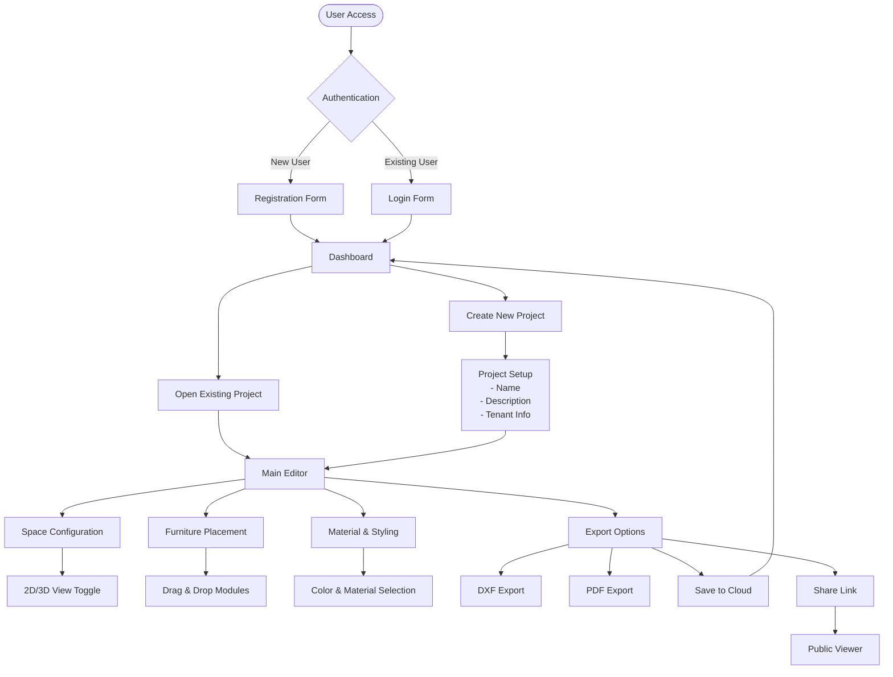
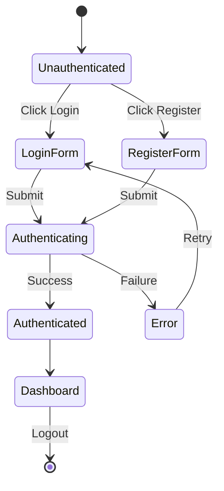
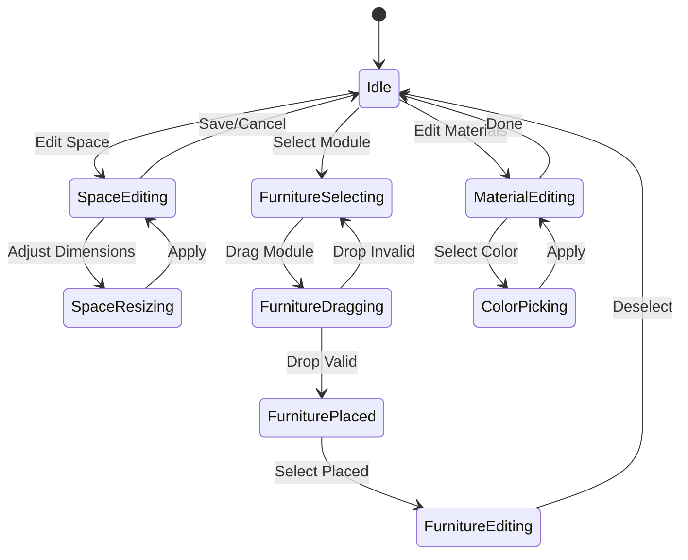
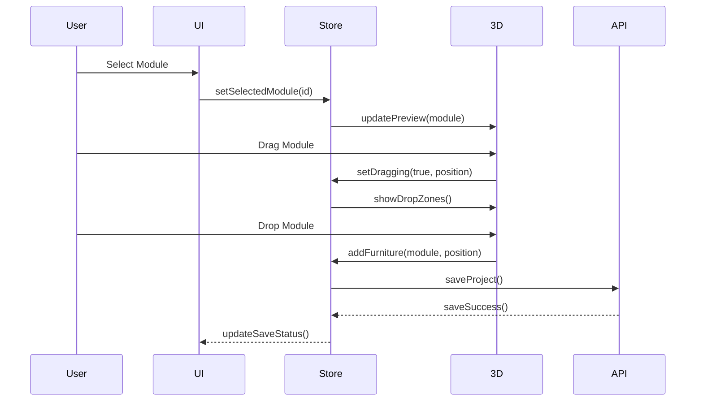

# UX Specification Document
## Furniture Editor Application

---

## 1. User Journey Flow



---

## 2. Screen State Transitions

### 2.1 Authentication Flow


### 2.2 Editor State Machine


---

## 3. Component Interaction Specifications

### 3.1 Main Editor Layout
```
┌─────────────────────────────────────────────────────────────────┐
│                          Header (Fixed)                         │
│  Logo | Project Name | Save Status | User Menu | Export Actions│
├──────────┬────────────────────────────────────┬────────────────┤
│          │                                    │                │
│ Sidebar  │      3D/2D Viewer Canvas          │  Right Panel   │
│          │                                    │                │
│ • Space  │  ┌──────────────────────┐         │ • Module List  │
│ • Modules│  │                      │         │ • Properties   │
│ • Style  │  │   Furniture Space    │         │ • Materials    │
│ • Export │  │                      │         │ • Settings     │
│          │  └──────────────────────┘         │                │
│          │  [View Controls] [Zoom] [Reset]    │                │
└──────────┴────────────────────────────────────┴────────────────┘
```

### 3.2 Interaction Patterns

#### A. Module Placement
```yaml
trigger: Click module in gallery
states:
  - hover_preview: Show ghost preview at cursor
  - dragging: Module follows cursor in viewer
  - valid_drop: Green highlight on valid positions
  - invalid_drop: Red highlight on occupied/invalid
  - placed: Module locked to grid position
feedback:
  visual: Color-coded drop zones
  cursor: Grab/grabbing/not-allowed icons
  haptic: Vibration on mobile devices (if supported)
```

#### B. Space Dimension Controls
```yaml
trigger: Input or slider adjustment
validation:
  min_width: 1800mm
  max_width: 4200mm
  min_height: 2200mm
  max_height: 3300mm
  step: 10mm
feedback:
  immediate: Live 3D preview update
  visual: Dimension labels in viewer
  constraint: Auto-adjust furniture if space reduces
```

#### C. View Mode Toggle
```yaml
modes:
  2D:
    camera: Orthographic top-down
    controls: Pan only
    display: Floor plan view
  3D:
    camera: Perspective
    controls: Orbit, pan, zoom
    display: Realistic rendering
transition:
  duration: 500ms
  easing: ease-in-out
  preserve: Current selection state
```

---

## 4. User Input Handling

### 4.1 Mouse Interactions
| Action | Target | Response | State Change |
|--------|--------|----------|--------------|
| Click | Module in gallery | Select module | `selectedModule = moduleId` |
| Drag | Selected module | Move module | `dragging = true` |
| Drop | Valid grid position | Place module | `furniture.add(module)` |
| Right-click | Placed module | Context menu | `showContextMenu = true` |
| Scroll | Viewer canvas | Zoom in/out | `zoomLevel ± 10%` |
| Double-click | Placed module | Edit properties | `editingModule = moduleId` |

### 4.2 Keyboard Shortcuts
| Key | Action | Context |
|-----|--------|---------|
| Delete | Remove selected | Module selected |
| Ctrl+Z | Undo | Any |
| Ctrl+Y | Redo | Any |
| Ctrl+S | Save project | Any |
| Ctrl+C | Copy module | Module selected |
| Ctrl+V | Paste module | After copy |
| Tab | Switch panels | Any |
| Esc | Cancel operation | During drag/edit |
| Space | Toggle 2D/3D | Viewer focused |

### 4.3 Touch Gestures (Mobile/Tablet)
| Gesture | Action | Response |
|---------|--------|----------|
| Tap | Select | Highlight element |
| Long press | Context menu | Show options |
| Pinch | Zoom | Scale view |
| Two-finger drag | Pan | Move viewport |
| Swipe | Navigate tabs | Switch sections |

---

## 5. Accessibility Requirements

### 5.1 WCAG 2.1 AA Compliance
```yaml
perceivable:
  - text_alternatives: All images and icons have alt text
  - contrast_ratio: 4.5:1 for normal text, 3:1 for large
  - resize: Content functional up to 200% zoom
  - orientation: Support portrait and landscape

operable:
  - keyboard_navigation: All functions keyboard accessible
  - timing: No time limits on user actions
  - seizures: No flashing > 3Hz
  - navigation: Clear page titles and headings

understandable:
  - labels: Clear form labels and instructions
  - errors: Descriptive error messages
  - consistency: Uniform navigation and terminology

robust:
  - parsing: Valid HTML structure
  - aria: Proper ARIA labels and roles
  - compatibility: Screen reader support
```

### 5.2 Focus Management
```javascript
focusOrder: [
  "header.logo",
  "header.projectName",
  "header.saveButton",
  "header.userMenu",
  "sidebar.tabs",
  "viewer.canvas",
  "viewer.controls",
  "rightPanel.content",
  "rightPanel.actions"
]

focusIndicators: {
  style: "2px solid #0066cc",
  offset: "2px",
  animation: "none"
}
```

---

## 6. Performance Requirements

### 6.1 Loading Performance
```yaml
initial_load:
  target: < 3 seconds
  metrics:
    - FCP: < 1.5s
    - LCP: < 2.5s
    - TTI: < 3.0s
    
3d_model_load:
  small: < 500ms
  medium: < 1s
  large: < 2s
  
interactions:
  response: < 100ms
  animation: 60fps
  drag_feedback: < 16ms
```

### 6.2 Memory Management
```yaml
limits:
  max_furniture: 100 items
  max_undo_history: 50 actions
  texture_cache: 100MB
  
cleanup:
  - Dispose unused 3D objects
  - Clear undo history > 50
  - Compress project data
  - Lazy load heavy assets
```

---

## 7. Error Handling & Feedback

### 7.1 Error States
```yaml
network_error:
  message: "Connection lost. Your work is saved locally."
  action: Retry automatically every 30s
  fallback: Enable offline mode

validation_error:
  message: "Invalid dimension: {field} must be between {min} and {max}"
  visual: Red border on input field
  correction: Suggest nearest valid value

save_error:
  message: "Failed to save. Retrying..."
  action: Queue for retry
  fallback: Download local backup
```

### 7.2 Success Feedback
```yaml
save_success:
  visual: Green checkmark animation
  message: "Project saved"
  duration: 2 seconds

export_complete:
  visual: Download animation
  message: "Export ready: {filename}"
  action: Auto-download file

module_placed:
  visual: Pulse animation on module
  haptic: Light vibration (mobile)
  sound: Soft placement sound (optional)
```

---

## 8. TaskSpec for BUILDER-UI

### 8.1 Component Requirements
```typescript
interface UIComponents {
  Header: {
    props: {
      projectName: string;
      saveStatus: 'saved' | 'saving' | 'unsaved';
      user: UserInfo;
    };
    events: ['onSave', 'onExport', 'onUserMenu'];
  };
  
  Sidebar: {
    tabs: ['space', 'modules', 'materials', 'export'];
    activeTab: string;
    events: ['onTabChange'];
  };
  
  Viewer3D: {
    mode: '2D' | '3D';
    camera: CameraSettings;
    selection: string | null;
    events: ['onSelect', 'onDrop', 'onViewChange'];
  };
  
  ModuleGallery: {
    categories: string[];
    modules: Module[];
    events: ['onModuleSelect', 'onDragStart'];
  };
  
  PropertyPanel: {
    target: 'space' | 'module';
    properties: Record<string, any>;
    events: ['onChange', 'onApply'];
  };
}
```

### 8.2 State Management
```typescript
interface AppState {
  // User session
  auth: {
    user: User | null;
    isAuthenticated: boolean;
  };
  
  // Project data
  project: {
    id: string;
    name: string;
    isDirty: boolean;
    lastSaved: Date;
  };
  
  // Space configuration
  space: {
    width: number;
    height: number;
    depth: number;
    installType: 'corner' | 'wall' | 'center';
    materials: MaterialConfig;
  };
  
  // Furniture placement
  furniture: {
    items: PlacedModule[];
    selected: string | null;
    dragging: DragState | null;
  };
  
  // UI state
  ui: {
    viewMode: '2D' | '3D';
    activePanel: string;
    zoom: number;
    camera: CameraState;
  };
}
```

### 8.3 Event Flow


---

## 9. Mobile Responsiveness

### 9.1 Breakpoints
```css
/* Mobile Portrait */
@media (max-width: 767px) {
  - Hide sidebar, show as overlay
  - Stack panels vertically
  - Simplify viewer controls
  - Touch-optimized buttons (44x44px min)
}

/* Tablet Portrait */
@media (min-width: 768px) and (max-width: 1023px) {
  - Collapsible sidebar
  - Floating panels
  - Touch gestures enabled
}

/* Desktop */
@media (min-width: 1024px) {
  - Full layout with all panels
  - Hover states enabled
  - Keyboard shortcuts active
}
```

### 9.2 Touch Optimizations
```yaml
touch_targets:
  min_size: 44x44px
  spacing: 8px minimum
  
gestures:
  tap: Select
  long_press: Context menu
  pinch: Zoom
  drag: Pan/Move
  swipe: Navigate
  
feedback:
  visual: Immediate highlight
  haptic: Platform-specific
  audio: Optional sounds
```

---

## 10. Acceptance Criteria

### AC-1: User Flow Completion
- [ ] User can complete full journey from login to export
- [ ] All major flows documented and tested
- [ ] Navigation is intuitive and consistent

### AC-2: Interaction Responsiveness  
- [ ] All interactions respond within 100ms
- [ ] Drag and drop is smooth at 60fps
- [ ] No blocking UI operations

### AC-3: Accessibility Compliance
- [ ] WCAG 2.1 AA standards met
- [ ] Keyboard navigation fully functional
- [ ] Screen reader compatible

### AC-4: Error Recovery
- [ ] All errors have user-friendly messages
- [ ] Auto-save prevents data loss
- [ ] Graceful degradation for failures

### AC-5: Mobile Support
- [ ] Responsive design works on all devices
- [ ] Touch gestures properly implemented
- [ ] Performance acceptable on mobile

---

## Appendix: Design Tokens

```yaml
colors:
  primary: "#0066cc"
  secondary: "#00a86b"
  error: "#dc3545"
  warning: "#ffc107"
  success: "#28a745"
  
spacing:
  xs: 4px
  sm: 8px
  md: 16px
  lg: 24px
  xl: 32px
  
typography:
  heading1: 24px/32px
  heading2: 20px/28px
  body: 14px/20px
  caption: 12px/16px
  
animation:
  fast: 200ms
  normal: 300ms
  slow: 500ms
  easing: cubic-bezier(0.4, 0, 0.2, 1)
```