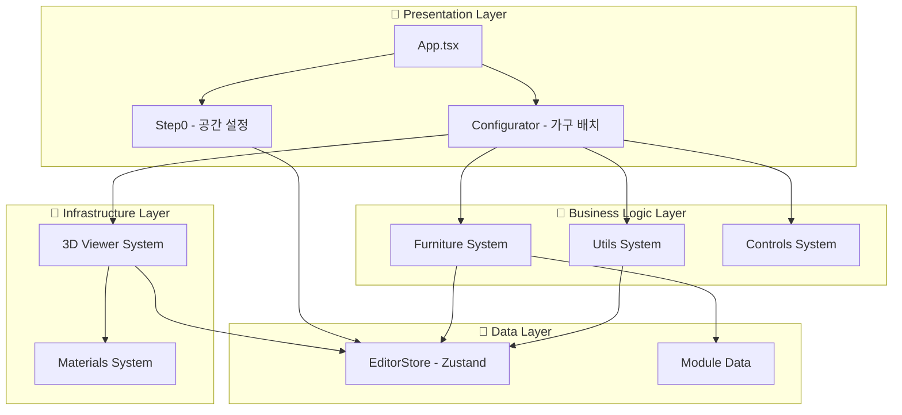

📅 1단계 (지금): 기본 Firebase 연동
├── auth/ (3개 파일)
├── firebase/ (4개 파일)  
├── pages/ (3개 파일)
└── components/dashboard/ (3개 파일)
   총 13개 파일 추가 → 저장/불러오기 완성! ✅

📅 2단계 (사용자 피드백 후): UX 개선
├── hooks/useAutoSave.ts          # 자동저장 요청 시
├── components/SaveIndicator.tsx  # 저장상태 표시 요청 시
└── utils/errorHandler.ts         # 에러 처리 개선 필요 시

📅 3단계 (더 많은 사용자): 고급 기능
├── services/analytics.ts         # 사용 통계 필요 시
├── components/collaboration/     # 협업 기능 필요 시
└── hooks/useRealtime.ts         # 실시간 동기화 필요 시

📅 4단계 (스케일업): 엔터프라이즈
├── lib/api/                     # 백엔드 API 분리 시
├── store/middleware/            # 복잡한 상태 관리 필요 시
└── services/export/             # 고급 내보내기 기능 시


# 🏗️ 프로젝트 아키텍처 문서

## 📋 개요

이 문서는 Furniture Editor 프로젝트의 전체 아키텍처를 설명합니다. 본 프로젝트는 **계층화된 아키텍처(Layered Architecture)**와 **단일 책임 원칙(Single Responsibility Principle)**을 기반으로 설계되었습니다.

## 🎯 아키텍처 원칙

### 1. 계층화된 구조 (Layered Architecture)
- **Presentation Layer**: 사용자 인터페이스 및 사용자 상호작용
- **Business Logic Layer**: 비즈니스 규칙 및 도메인 로직
- **Infrastructure Layer**: 3D 렌더링, 재질 시스템 등 기술적 구현
- **Data Layer**: 상태 관리 및 데이터 저장

### 2. 단일 책임 원칙 (Single Responsibility Principle)
- 각 모듈과 클래스는 하나의 명확한 책임만 담당
- 코드 변경 시 영향 범위 최소화
- 테스트 용이성 및 유지보수성 향상

### 3. 의존성 역전 원칙 (Dependency Inversion Principle)
- 상위 레벨 모듈이 하위 레벨 모듈에 의존하지 않음
- 추상화를 통한 느슨한 결합
- 인터페이스 기반 설계

## 🏛️ 전체 시스템 아키텍처



## 📁 디렉토리 구조

```
src/
├── 🎯 Presentation Layer
│   ├── App.tsx                    # 메인 애플리케이션
│   ├── editor/
│   │   ├── Step0/                 # 공간 설정 단계
│   │   └── Configurator/          # 가구 배치 단계
│   └── components/                # 공통 UI 컴포넌트
│
├── 🧠 Business Logic Layer
│   └── editor/shared/
│       ├── furniture/             # 가구 관리 시스템
│       ├── utils/                 # 비즈니스 로직 유틸리티
│       └── controls/              # UI 컨트롤 컴포넌트
│
├── 🎨 Infrastructure Layer
│   └── editor/shared/viewer3d/    # 3D 렌더링 시스템
│       ├── components/            # 3D 컴포넌트
│       └── utils/                 # 3D 유틸리티
│
└── 💾 Data Layer
    ├── store/                     # 상태 관리 (Zustand)
    └── data/                      # 정적 데이터
```

## 🪑 가구 시스템 아키텍처

### Provider 분리 구조
가구 시스템은 **4개의 분리된 Provider**로 구성되어 각각 단일 책임을 담당합니다:

```typescript
// 1. 데이터 관리
FurnitureDataProvider: {
  placedModules, addModule, removeModule, updatePlacedModule, clearAllModules
}

// 2. 선택 상태 관리
FurnitureSelectionProvider: {
  selectedLibraryModuleId, selectedPlacedModuleId, clearAllSelections
}

// 3. UI 모드 관리
FurnitureUIProvider: {
  isFurniturePlacementMode, editMode, editingModuleId, exitEditMode
}

// 4. 드래그 상태 관리
FurnitureDragProvider: {
  currentDragData, setCurrentDragData, clearDragData
}
```

### 공간 변경 적응 시스템
```typescript
// HOC 패턴을 통한 공간 변경 기능 제공
withFurnitureSpaceAdapter(Component) -> {
  preserveFurnitureOnSpaceChange,
  updateFurnitureForNewSpace,
  spaceChangeMode
}
```

## 🔢 유틸리티 시스템 아키텍처

### Indexing 모듈 (단일 책임 분리)
기존 432라인의 God Object를 4개 클래스로 분리:

```typescript
// 1. 공간 계산 (95라인)
SpaceCalculator: {
  calculateInternalSpace(),
  calculateFrameThickness(),
  calculateBaseFrame()
}

// 2. 컬럼 인덱싱 (189라인)
ColumnIndexer: {
  calculateColumnWidth(),
  calculateColumnCount(),
  generateColumnIndexes()
}

// 3. 가구 위치 계산 (55라인)
FurniturePositioner: {
  calculateFurniturePosition(),
  calculateCenterPosition()
}

// 4. 공간 변경 적응 (136라인)
FurnitureSpaceAdapter: {
  adaptFurnitureToNewSpace(),
  preserveFurnitureLayout()
}
```

## 🎨 재질 시스템 아키텍처

### 분리된 책임 구조
```typescript
// 1. 텍스처 생성 (347라인)
TextureGenerator: {
  createWallTexture(),
  createFloorTexture(),
  createGradientTexture()
}

// 2. 재질 생성 + 캐싱 (220라인)
MaterialFactory: {
  createWallMaterial(),
  createFloorMaterial(),
  // 캐싱을 통한 성능 최적화
}
```

## 💾 상태 관리 아키텍처

### Zustand 기반 상태 관리
```typescript
// 1. 메인 에디터 상태
editorStore: {
  spaceInfo,        // 공간 정보
  basicInfo,        // 기본 정보
  customization,    // 커스터마이징
  viewMode,         // 2D/3D 모드
  materialConfig    // 재질 설정
}

// 2. 파생 상태 (Derived State)
derivedSpaceStore: {
  // spaceInfo로부터 계산되는 파생 값들
  internalSpace,
  columnCount,
  indexing
}
```

## 🔄 데이터 플로우

### 1. 공간 설정 플로우
```
Step0 → setSpaceInfo → editorStore → Configurator → 3D Viewer
```

### 2. 가구 배치 플로우
```
ModuleLibrary → FurnitureDrag → SlotDropZones → FurnitureData → 3D Render
```

### 3. 재질 변경 플로우
```
MaterialPanel → setSpaceInfo → materialConfig → MaterialFactory → 3D Render
```

## ✅ 아키텍처 장점

### 1. 확장성 (Scalability)
- 새로운 기능 추가 시 기존 코드 영향 최소화
- 모듈별 독립적 개발 가능

### 2. 유지보수성 (Maintainability)
- 단일 책임 원칙으로 코드 변경 범위 명확
- 각 모듈의 역할과 책임이 명확히 분리

### 3. 테스트 용이성 (Testability)
- 각 클래스와 함수의 단위 테스트 가능
- 의존성 주입을 통한 모킹 용이

### 4. 성능 최적화
- MaterialFactory의 캐싱 시스템
- Provider 분리를 통한 불필요한 리렌더링 방지
- 3D 레이캐스팅 최적화

## ⚠️ 개선 필요 영역

### 1. God Object 패턴 해결
- `editorStore.ts` (249라인) → 도메인별 스토어 분리 고려
- `Space3DView.tsx` (223라인) → 렌더링과 상태 관리 분리

### 2. 테스트 커버리지 확대
- 비즈니스 로직 단위 테스트 추가
- 통합 테스트 시나리오 구축

### 3. 타입 안전성 강화
- 더 엄격한 TypeScript 설정
- 런타임 타입 검증 추가

## 🚀 향후 발전 방향

### 1. 마이크로 프론트엔드 고려
- 각 에디터 단계를 독립적인 앱으로 분리 가능한 구조

### 2. 플러그인 아키텍처
- 새로운 가구 타입이나 기능을 플러그인으로 추가 가능한 구조

### 3. 상태 관리 최적화
- 복잡한 상태의 경우 Redux Toolkit 도입 고려
- 상태 정규화(Normalization) 적용

---

*이 문서는 프로젝트 발전에 따라 지속적으로 업데이트됩니다.* 