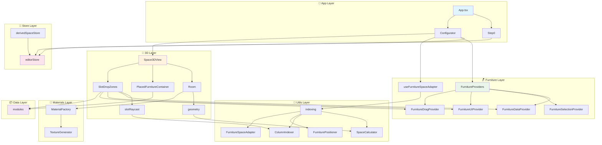
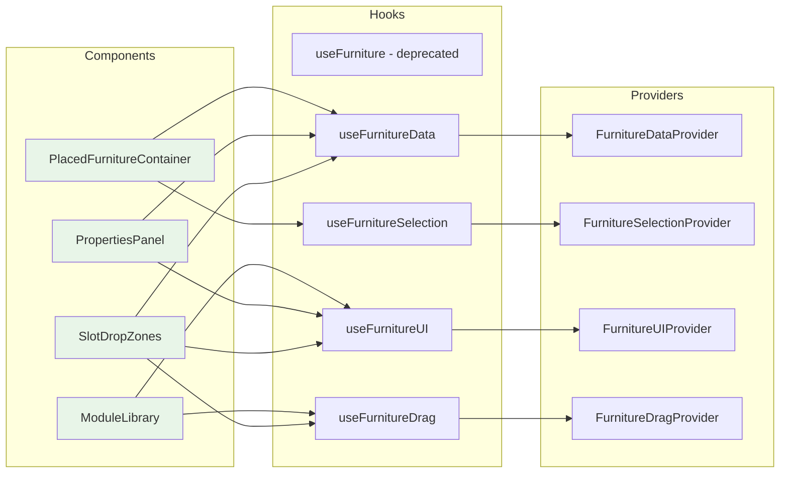
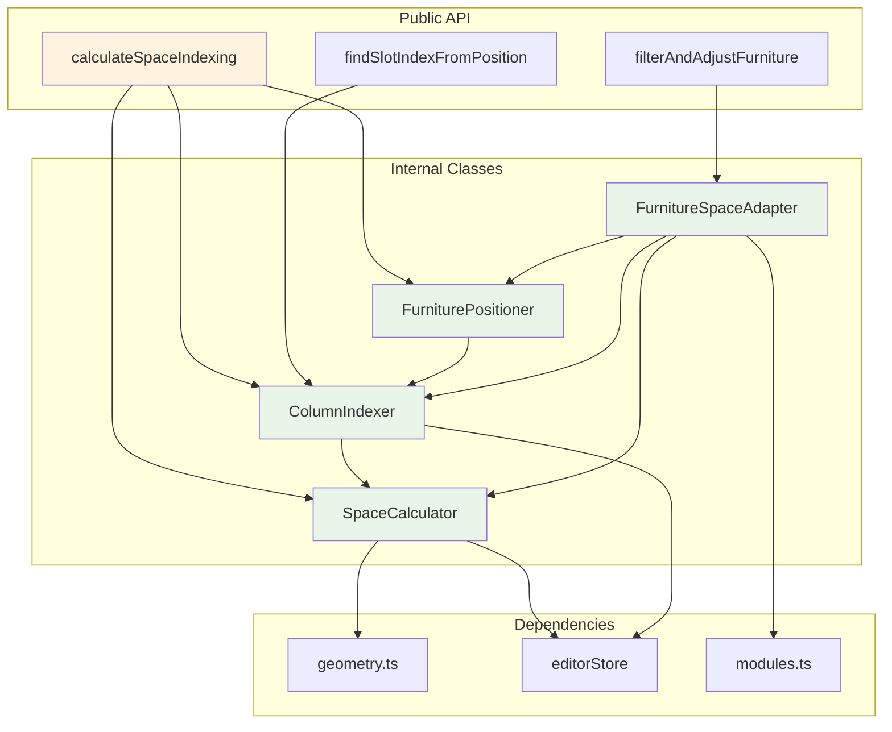
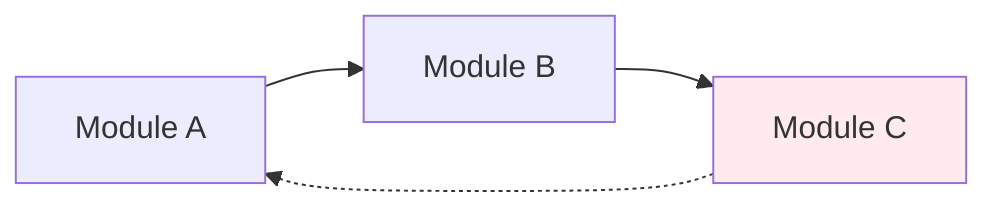

# 🔗 의존성 그래프 (Dependency Graph)

## 📋 개요

이 문서는 Furniture Editor 프로젝트의 모듈 간 의존성 관계를 시각화합니다. 의존성 그래프를 통해 코드의 결합도와 응집도를 분석하고, 리팩토링 우선순위를 결정할 수 있습니다.

## 🏗️ 전체 모듈 의존성



## 🔍 세부 의존성 분석

### 1. 🪑 가구 시스템 의존성



### 2. 🔢 유틸리티 시스템 의존성



### 3. 🎨 3D 시스템 의존성

```mermaid
graph TD
    subgraph "3D Components"
        S3D[Space3DView]
        ROOM[Room]
        PFC[PlacedFurnitureContainer]
        FI[FurnitureItem]
        SDZ[SlotDropZones]
    end
    
    subgraph "3D Utils"
        GEO[geometry]
        RAY[slotRaycast]
        MAT[materials]
    end
    
    subgraph "Materials"
        TG[TextureGenerator]
        MF[MaterialFactory]
    end
    
    subgraph "External"
        THREE[Three.js]
        R3F[@react-three/fiber]
        DREI[@react-three/drei]
    end
    
    S3D --> ROOM
    S3D --> PFC
    S3D --> SDZ
    ROOM --> GEO
    ROOM --> MF
    PFC --> FI
    SDZ --> RAY
    SDZ --> GEO
    
    GEO --> THREE
    RAY --> THREE
    MF --> TG
    MF --> THREE
    TG --> THREE
    
    S3D --> R3F
    ROOM --> DREI
    FI --> DREI
    
    style S3D fill:#fff3e0
    style THREE fill:#f3e5f5
    style R3F fill:#f3e5f5
    style DREI fill:#f3e5f5
```

## 📊 의존성 메트릭

### 1. 결합도 (Coupling) 분석

| 모듈 | 의존하는 모듈 수 | 의존되는 모듈 수 | 결합도 |
|------|------------------|------------------|--------|
| editorStore | 0 | 8 | 높음 ⚠️ |
| Space3DView | 6 | 1 | 높음 ⚠️ |
| indexing | 3 | 5 | 보통 |
| FurnitureProviders | 4 | 3 | 보통 |
| MaterialFactory | 2 | 2 | 낮음 ✅ |

### 2. 응집도 (Cohesion) 분석

| 모듈 | 단일 책임 | 응집도 |
|------|-----------|--------|
| SpaceCalculator | ✅ 공간 계산만 담당 | 높음 ✅ |
| ColumnIndexer | ✅ 컬럼 인덱싱만 담당 | 높음 ✅ |
| FurnitureDataProvider | ✅ 데이터 CRUD만 담당 | 높음 ✅ |
| editorStore | ❌ 여러 도메인 관리 | 낮음 ⚠️ |
| Space3DView | ❌ 렌더링 + 상태 관리 | 낮음 ⚠️ |

## 🚨 의존성 문제점 및 해결 방안

### 1. 순환 의존성 (Circular Dependencies)
현재 발견된 순환 의존성은 없으나, 주의 깊게 모니터링 필요:



### 2. God Object 패턴
**문제**: `editorStore`가 너무 많은 책임을 가짐
**해결**: 도메인별 스토어 분리
```typescript
// 현재
editorStore: { spaceInfo, basicInfo, customization, viewMode, materialConfig }

// 개선안
spaceStore: { spaceInfo, viewMode }
materialStore: { materialConfig }
uiStore: { basicInfo, customization }
```

### 3. 높은 결합도
**문제**: `Space3DView`가 너무 많은 모듈에 의존
**해결**: 컴포넌트 분리 및 의존성 주입
```typescript
// 현재
Space3DView → Room, Furniture, Controls, Store

// 개선안
Space3DView → RenderEngine
RenderEngine → Room, Furniture
ControlLayer → Controls, Store
```

## 🎯 리팩토링 우선순위

### 1. 높은 우선순위 (High Priority)
- [ ] `editorStore` 도메인별 분리
- [ ] `Space3DView` 컴포넌트 분리
- [ ] 순환 의존성 모니터링 시스템 구축

### 2. 중간 우선순위 (Medium Priority)
- [ ] 의존성 주입 패턴 도입
- [ ] 인터페이스 기반 추상화 강화
- [ ] 테스트 더블(Test Double) 구현

### 3. 낮은 우선순위 (Low Priority)
- [ ] 의존성 그래프 자동 생성 도구 도입
- [ ] 아키텍처 결정 기록(ADR) 시스템 구축

## 🔧 의존성 관리 도구

### 1. 분석 도구
```bash
# 의존성 분석
npm install -g madge
madge --image deps.png src/

# 순환 의존성 검사
madge --circular src/
```

### 2. 시각화 도구
```bash
# 의존성 그래프 생성
npm install -g dependency-cruiser
depcruise --output-type dot src/ | dot -T svg > dependency-graph.svg
```

### 3. 린팅 규칙
```typescript
// eslint 규칙 예시
"import/no-cycle": "error",
"import/no-self-import": "error",
"import/no-unused-modules": "warn"
```

---

*이 의존성 그래프는 코드 변경에 따라 정기적으로 업데이트되어야 합니다.* 